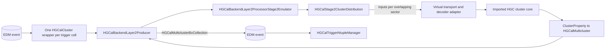

# Stage-2 firmware emulator integration

This page is the user-facing entry point for the new HGCal Stage-2 firmware
emulator integration. It explains how to check out the development branch,
produce a comparison ntuple, and find the CMSSW components that connect the
emulator to the event-processing framework.

The current integration targets `CMSSW_20_1_0_pre2`, V19 HGCal geometry, and
the `s2EmuIntegration` branch of `hgc-tpg/cmssw`. At the checkpoint documented
here, the branch head is
`d29f106b02c30e8c3c5f4d060f002b4676fcbdd2`.

## What is integrated

The validation workflow runs three Layer-2 cluster algorithms from the same
Layer-1 input collection. Although its EDM type is
`l1t::HGCalClusterBxCollection`, the configured `dummyC2d` algorithm creates
exactly one `HGCalCluster` wrapper per concentrator trigger cell; it does not
merge trigger cells into genuine two-dimensional clusters.

1. The current CMSSW simulation/reference algorithm.
2. The historical semi-emulator, retained as a comparison implementation.
3. The new full firmware cluster emulator imported from the standalone
   Stage2 repository.

The imported core also contains tower-processing modules, but the new tower
path is **not yet connected to CMSSW EDM tower inputs or outputs**. The normal
CMSSW tower chain may run as part of the trigger-primitives task, but it does
not exercise the imported Stage2 tower emulator.

## Checkout and build

These instructions create a proper SCRAM release area. Cloning the CMSSW
source repository by itself is not sufficient.

```bash
source /cvmfs/cms.cern.ch/cmsset_default.sh
export SCRAM_ARCH=el9_amd64_gcc13

cmsrel CMSSW_20_1_0_pre2
cd CMSSW_20_1_0_pre2/src
cmsenv
git cms-init

git remote add hgctpg https://github.com/hgc-tpg/cmssw.git
git fetch hgctpg s2EmuIntegration
git switch --create s2EmuIntegration --track hgctpg/s2EmuIntegration
```

Record the exact checkout before comparing results:

```bash
git rev-parse HEAD
git status --short --branch
echo "$SCRAM_ARCH"
```

Build the package and run its registered test:

```bash
scram b -j 4 L1Trigger/L1THGCal
scram b runtests_L1Trigger_L1THGCal
```

The registered test runs `testHGCalStage2Emulator_cfg.py` with an
`EmptySource` and zero events. It checks configuration construction and plugin
loading, but it does not execute the per-event clustering algorithm. Use the
real-input workflow below for event-level validation.

After a successful build, `edmPluginRefresh` should not normally be needed. If
CMSSW unexpectedly reports that a newly built processor plugin is unknown, use
it as a diagnostic fallback:

```bash
edmPluginRefresh -p "$CMSSW_BASE/lib/$SCRAM_ARCH"
```

## Produce the comparison ntuple

The checked validation configuration is
[`test/runHGCalStage2EmulatorV19_cfg.py`](../test/runHGCalStage2EmulatorV19_cfg.py).
It uses:

- Era `Phase2C26I13M9`;
- D127/V19 geometry;
- GlobalTag `auto:phase2_realistic_T35`;
- the no-pileup D127 `RelValSingleGammaFlatPt8To150` input used during
  development.

On DICE, run:

```bash
cmsRun L1Trigger/L1THGCal/test/runHGCalStage2EmulatorV19_cfg.py \
  inputFile=file:/dice/users/ec6821/HGC/LocalInputs/RelValSingleGammaFlatPt8To150_CMSSW_20_0_0_150X_mcRun4_realistic_v1_STD_D127_RecycledGEN_noPU_16Aug26.root \
  maxEvents=10 \
  outputFile=stage2-threeway.root
```

Outside DICE, the same CMS file can be read through XRootD:

```bash
cmsRun L1Trigger/L1THGCal/test/runHGCalStage2EmulatorV19_cfg.py \
  inputFile=root://cms-xrd-global.cern.ch//store/relval/CMSSW_20_0_0/RelValSingleGammaFlatPt8To150/GEN-SIM-DIGI-RAW/150X_mcRun4_realistic_v1_STD_D127_RecycledGEN_noPU_16Aug26-v4/2590000/0a7f118a-0e5a-40f2-b6b1-a78775e3a22c.root \
  maxEvents=10 \
  outputFile=stage2-threeway.root
```

With the current `VarParsing('analysis')` configuration, the observed output
name includes the event-count suffix, for example
`stage2-threeway_numEvent10.root`. Check the actual name rather than assuming
it:

```bash
ls -lh stage2-threeway*.root
```

Treat a non-zero `cmsRun` exit status as a failed job, even if a ROOT file was
created. A one-event run checks the event products and EventSetup records; a
ten-event run additionally exercises event-to-event reset and repeatability.

## Inspect the ntuple

The `TFileService` tree is below the analyzer module directory, not at the
ROOT-file top level:

```bash
root -l stage2-threeway_numEvent10.root
```

Then, in ROOT:

```cpp
_file0->ls();
auto tree = _file0->Get<TTree>(
    "l1tHGCalTriggerNtuplizer/HGCalTriggerNtuple");
tree->GetEntries();
tree->Print();
```

The most useful branch prefixes are:

| Prefix | Content |
| --- | --- |
| `cl2d_*` | Shared one-per-trigger-cell Layer-1 `HGCalCluster` wrappers |
| `refcl3d_*` | Current CMSSW simulation/reference Layer-2 output |
| `semicl3d_*` | Historical semi-emulator output |
| `s2cl3d_*` | New full firmware cluster-emulator output |

## CMSSW component structure

The Producer and Processor have deliberately different responsibilities:

- The **Producer** is an `EDProducer`. It reads products from the EDM event,
  obtains EventSetup data, owns the selected Processor plugin, and writes the
  Processor results back into the event.
- The **Processor** contains the event-level Stage-2 processing sequence. In
  this integration it also divides the Layer-1 inputs among Stage-2 FPGA
  sectors and invokes the imported core once for each sector.
- The **imported core** contains the firmware-oriented fixed-width algorithm
  blocks. It has no knowledge of `edm::Event`, `edm::Handle`, or CMSSW product
  labels.



### `HGCalBackendLayer2Producer`: the EDM boundary

The framework module is implemented in
[`plugins/HGCalBackendLayer2Producer.cc`](../plugins/HGCalBackendLayer2Producer.cc)
and configured as `l1tHGCalBackEndLayer2Producer` in
[`python/l1tHGCalBackEndLayer2Producer_cfi.py`](../python/l1tHGCalBackEndLayer2Producer_cfi.py).

It consumes:

```text
l1tHGCalBackEndLayer1Producer:
  HGCalBackendLayer1Processor2DClustering
```

as an `l1t::HGCalClusterBxCollection`. In this workflow, however, the upstream
`HGCalBackendLayer1Processor2DClustering` is configured with
`clusterType = "dummyC2d"`. `HGCalClusteringDummyImpl` constructs one
`HGCalCluster` from each input `HGCalTriggerCell`; every wrapper has that one
trigger cell as its constituent. The resolved V19 configuration also has
`applyLayerCalibration = false` and `calibSF_cluster = 1`, so the dummy step
does not rescale the trigger-cell transverse momentum. It is therefore best
understood as a data-format adapter rather than a clustering operation.

The default Layer-1 Producer also has `BypassBackendMapping = true`, so these
objects are not divided by the Layer-1 backend mapping in this workflow. The
new Layer-2 Processor subsequently uses the trigger geometry to determine the
Stage-1 and candidate Stage-2 FPGA sectors for each detector ID.

At the beginning of a run, the Layer-2 Producer obtains the HGCal trigger
geometry from the `CaloGeometryRecord` and passes that geometry to the
selected Processor. For every event it calls the Processor's `run()` method
and stores two collections, with instance labels derived from the Processor
name:

```text
l1t::HGCalMulticlusterBxCollection
  <producer module>:<processor name>

l1t::HGCalClusterBxCollection
  <producer module>:<processor name>Unclustered
```

The full-emulator Processor currently does not fill the unclustered output.

The Producer is generic: changing `ProcessorParameters.ProcessorName` selects
a different Layer-2 Processor without changing the EDM wrapper.

### `HGCalBackendLayer2ProcessorStage2Emulator`: the CMSSW adapter

The new Processor plugin is implemented in
[`plugins/backend/HGCalBackendLayer2ProcessorStage2Emulator.cc`](../plugins/backend/HGCalBackendLayer2ProcessorStage2Emulator.cc).
It derives
from `HGCalBackendLayer2ProcessorBase` and is created through the
`HGCalBackendLayer2Factory` plugin factory.

Its `run()` method performs the sector split:

1. For each one-trigger-cell `HGCalCluster` wrapper, use its detector ID and
   trigger geometry to find the module and Stage-1 FPGA.
2. Obtain the possible Stage-2 FPGAs connected to that Stage-1 FPGA.
3. Ask `HGCalStage2ClusterDistribution` which Stage-2 FPGA sector or sectors
   should receive the cluster. Inputs in an overlap region may be sent to more
   than one sector.
4. Call `runSector()` once for each populated Stage-2 FPGA sector.

`runSector()` is the boundary between CMSSW objects and the firmware-oriented
types. It currently:

1. Rotates each input position into sector-local coordinates.
2. Assigns the input deterministically to a virtual frame and decoder lane.
3. Builds a temporary decoder record from the V19 geometry and encodes the
   wrapped trigger cell as a `LinkTriggerCell`-like input.
4. Calls `HGC::Cluster_Decode()` and then `HGC::Clusters_Step2()`.
5. Converts each valid `ClusterProperty` to an
   `l1t::HGCalMulticluster`.
6. Publishes only clusters with `Nominal_Phi`, because each overlapping
   approximately 180-degree processing region owns only its central
   120-degree output region.

This means the current adapter bypasses the real input-link unpacking and
routing stage. It does not yet know the true link/frame/position on which a
given detector object arrives.

### Sector distribution

[`HGCalStage2ClusterDistribution`](../src/backend/HGCalStage2ClusterDistribution.cc)
is existing CMSSW
infrastructure shared with the reference Stage-2 processing. It uses the
trigger geometry, the Stage-1 to Stage-2 FPGA connectivity, r/z bins, and
phi-sector boundaries to select the appropriate overlapping Stage-2 sectors.

It decides **which sector receives an input**. The temporary frame/lane
assignment inside that sector is a separate responsibility of the new
Processor adapter.

### Imported firmware-emulator core

The imported snapshot is under [`interface/HGC/`](../interface/HGC/); its
provenance and update policy are recorded in
[`interface/HGC/README.md`](../interface/HGC/README.md). `HGC.hpp` chains the
individual algorithm blocks in `interface/HGC/modules/`.

The adapter currently invokes the cluster `Step2` chain, beginning with
decoded proto-clusters. The imported link unpacking/routing and tower chains
are present in the snapshot but are not used by the CMSSW adapter yet.

`Clusters_Step2()` was already part of the standalone emulator; it was not
introduced for CMSSW. The standalone cluster path is divided as follows:

```text
raw input link words
  -> Links_UnpackInput
  -> LinkTriggerCell records
  -> Clusters_Step1
       -> Cluster_Routing
       -> Cluster_Decoders, including the decoder-ROM lookup
  -> decoded proto-clusters (Cluster records)
  -> Clusters_Step2
       -> accumulator and column adder
       -> hexagon sums and overlap/triangle filtering
       -> funnel and buffer
       -> cluster-property calculation
  -> ClusterProperty records
  -> Cluster_PackLinks
  -> cluster output link words
```

Thus `Clusters_Step2()` handles nearly all cluster formation downstream of
routing and decoder-ROM unpacking, but it does not include raw link unpacking,
cluster routing/decoding, final output-link packing, the tower path, or the
cluster/tower output mux.

The current CMSSW route is instead:

```text
one-trigger-cell HGCalCluster wrapper
  -> deterministic virtual frame/lane plus geometry-derived decoder record
  -> Cluster_Decode
  -> decoded proto-cluster
  -> the existing Clusters_Step2 chain
  -> ClusterProperty
  -> l1t::HGCalMulticluster
```

For CMSSW, the large local intermediate arrays inside `Clusters_Step2()` were
moved into a heap-backed workspace to avoid exhausting a worker thread's
stack. This changes storage placement, not the sequence of algorithm blocks.
The single-cell `Cluster_Decode()` entry point was factored from the existing
array decoder logic so that the adapter can supply a geometry-derived decoder
record directly.

CMSSW-specific event handling, geometry lookup, temporary transport,
conversion, and future constituent bookkeeping should remain outside this
directory wherever practical. A correction to the core algorithm should be
identified as an upstream Stage2 change and propagated to the standalone
repository.

### Historical semi-emulator

The semi-emulator is selected by the
[`HGCalBackendLayer2ProcessorSemiEmulator`](../plugins/backend/HGCalBackendLayer2ProcessorSemiEmulator.cc)
plugin. It uses the same generic `HGCalBackendLayer2Producer` EDM wrapper and
therefore consumes the same one-per-trigger-cell `HGCalCluster` collection as
the reference and full-emulator Processors.

Its processing route is:

```text
one-trigger-cell HGCalCluster wrappers
  -> three overlapping 180-degree sectors per endcap
  -> sector-local TPGTCFloats
  -> fixed-width TPGTCBits, retaining a CMSSW input index
  -> historical triangular/hexagonal clustering
  -> fixed-width HGCalCluster_HW property calculation
  -> TPGCluster
  -> l1t::HGCalMulticluster
```

There are six sector containers in total: sectors 0--2 for one endcap and
3--5 for the other. For each endcap, the Processor rotates an input into each
of the three sector coordinate systems and includes it when the rotated
`x/z` is non-negative. This supplies an approximately 180-degree input region
to each sector. The historical algorithm outputs local maxima only from the
central approximately 120-degree region, providing the nominal ownership of
overlap-region clusters.

Within each sector, the adapter records energy, position, detector layer, and
the input vector index in `TPGTCBits`. `TPGStage2Emulation::Stage2` accumulates
the inputs on three offset triangular grids, finds local maxima in two passes,
and evaluates cluster properties using fixed-width accumulator and
`HGCalCluster_HW` representations. The mean-eta and sigma-eta property LUTs
are loaded from `L1Trigger/L1THGCal/data/mean_eta_LUT.csv` and
`sigma_eta_LUT.csv` through `edm::FileInPath`.

Unlike the current full-emulator adapter, the semi-emulator propagates its
CMSSW input indices through the clustering calculation. On conversion back to
`l1t::HGCalMulticluster`, it uses those indices to restore valid
`edm::Ptr<l1t::HGCalCluster>` constituents. It then:

- preserves the semi-emulator pT, eta, and phi as the output four-vector;
- copies the fixed-width hardware energy, position, quality, longitudinal,
  and shower-shape quantities;
- fills the standard CMSSW shower shapes using the restored constituents;
- saves the electromagnetic energy interpretation when the hardware energy
  is non-zero.

The implementation under
[`interface/backend_semiemulator/`](../interface/backend_semiemulator/) is
historical. Its provenance is recorded in the directory
[`README.md`](../interface/backend_semiemulator/README.md): the source came
from `indra-ehep/hgcal-tpg-fe` commit
`6c1806002cf47f278a6a34f9e7a7096f64500cf5`, through the older CMSSW
integration at commit `c1a9cc5b3ec482c461c07e7a0d2be6c807ea1e60`.

It is useful as a physics and conversion cross-check, but it is not a model of
the current Stage2 firmware chain and should not be used as a bitwise
reference for the new full emulator. The CMSSW import also replaces a
historical shared rotation temporary with call-local state for safe concurrent
use.

### Python configuration and the three-way comparison

`stage2_emulator_proc` in
[`python/l1tHGCalBackEndLayer2Producer_cfi.py`](../python/l1tHGCalBackEndLayer2Producer_cfi.py)
selects the new Processor and
holds its integration parameters. `custom_stage2_emulator(process)` replaces
the default Layer-2 Processor with it.

`custom_stage2_comparison(process)` in
[`python/customNewProcessors.py`](../python/customNewProcessors.py) goes one
step further:

- the normal module label `l1tHGCalBackEndLayer2Producer` runs the new full
  emulator;
- `l1tHGCalBackEndLayer2ProducerReference` is a clone configured with the
  current CMSSW reference Processor;
- `l1tHGCalBackEndLayer2ProducerSemiEmulator` is a clone configured with the
  historical semi-emulator Processor.

All three Producer instances consume the same one-per-trigger-cell Layer-1 EDM
collection. Their multicluster products are:

| Producer module | Product instance |
| --- | --- |
| `l1tHGCalBackEndLayer2Producer` | `HGCalBackendLayer2ProcessorStage2Emulator` |
| `l1tHGCalBackEndLayer2ProducerReference` | `HGCalBackendLayer2Processor3DClustering` |
| `l1tHGCalBackEndLayer2ProducerSemiEmulator` | `HGCalBackendLayer2ProcessorSemiEmulator` |

### Ntuple production

[`runHGCalStage2EmulatorV19_cfg.py`](../test/runHGCalStage2EmulatorV19_cfg.py)
schedules the complete HGCal trigger
primitive task, applies the three-way customization, and runs the
`HGCalTriggerNtupleManager` analyzer in an EndPath. The analyzer reads the
shared one-per-trigger-cell Layer-1 collection and the three Layer-2 products
and writes one ROOT tree through `TFileService`.

The ntuple is a validation output. It is not an EDM output file containing the
new collections for later CMSSW jobs. The Layer-2 products do exist in the
event while this process runs and can be consumed by downstream modules placed
in the same process; a separate `PoolOutputModule` would be needed to persist
them as EDM products.

## Current limitations and open decisions

These points are intentional limitations or unresolved findings at the
documented checkpoint:

- **Temporary input transport and decoder ROM:** the adapter uses a
  deterministic virtual frame/lane assignment and geometry-derived decoder
  values. It is not the final FE/BE link mapping and is not evidence of
  full-chain bitwise agreement.
- **Core overlap-filter wiring:** `HGC::Clusters_Step2()` calculates filtered
  intermediate clusters but currently feeds the unfiltered arrays to the next
  blocks. Connecting the filtered arrays recovered missing energy in a local
  diagnostic, but that core change has not been committed and should be
  agreed with the standalone emulator maintainer.
- **High-energy position arithmetic:** the 16-bit position weight wraps at
  approximately 128 GeV with the current input scale. Cluster energy can
  remain plausible while eta, phi, and `Nominal_Phi` are corrupted. No fix is
  applied pending confirmation of the intended firmware scale and overflow
  handling.
- **Histogram boundaries:** the provisional position-to-histogram conversion
  clamps out-of-range inputs onto boundary rows or columns. This can create
  artificial pile-ups and saturated positions.
- **Constituents:** full-emulator `HGCalMulticluster` outputs do not yet contain
  `edm::Ptr` references to their Layer-1 constituents. Exact association needs
  CMSSW-only bookkeeping that does not change the firmware arithmetic.
- **Towers:** the imported core tower functions are not yet connected to the
  CMSSW tower EDM chain or this comparison ntuple.
- **Semi-emulator status:** the semi-emulator is a historical validation
  implementation, not an emulator of the current firmware.

## Validation status

At commit `d29f106b02c30e8c3c5f4d060f002b4676fcbdd2`, the following had passed in
the development area:

```bash
scram b -j 1 L1Trigger/L1THGCal
scram b runtests_L1Trigger_L1THGCal
```

The three-way D127 workflow also completed for ten events. The registered
SCRAM test remains a zero-event smoke test; the ten-event job is the relevant
event-level check.

Before a PR-ready handoff, rerun a clean package build, the registered tests,
and the real-input workflow. Then run:

```bash
git diff --check
scram b code-checks
scram b code-format
```

Inspect formatting changes rather than committing them blindly: a policy
decision is still needed on whether the imported core follows CMSSW formatting
or remains close to the standalone source for mechanical synchronisation.
